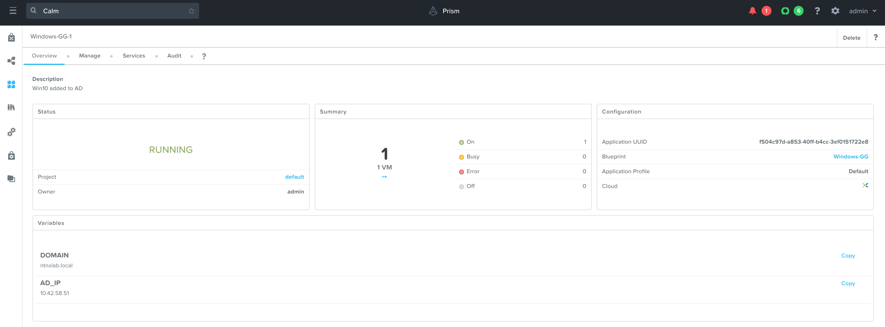
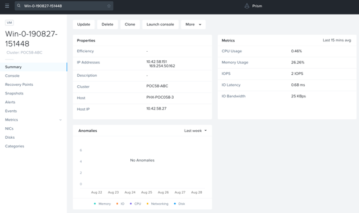
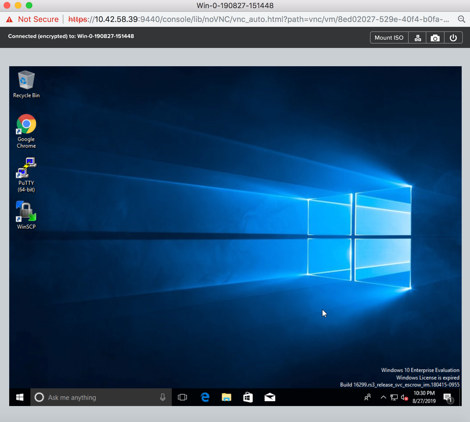

.. title:: CALM Windows Workshop

.. toctree::
  :maxdepth: 2
  :caption: Appendix
  :name: _appendix
  :hidden:

.. _calm_win:

-----------------------
Calm: Windows AD
-----------------------

Overview
++++++++

.. note::
   *The estimated time to complete this lab is **45** minutes.*
   In this exercise you will create a Nutanix Calm Blueprint based on a Microsoft Windows 10 image. The image will be sysprepped with an unattended XML answer file, and then will be added to a Domain via a Powershell script. We’ll also add a script to remove the computer from the Domain upon deletion.

Verifying the Default Project
+++++++++++++++++++++++++++++

#. In **Prism Central**, select : Services > Calm**.

   .. figure:: images/project0.png

#. Click |projects| **Projects** in the left hand toolbar and select the **default** project.

   .. note::
     Mousing over an icon will display its title.

Creating A Project
++++++++++++++++++

Projects are the logical construct that integrate Calm with Nutanix's native Self-Service Portal (SSP) capabilities, allowing an administrator to assign both infrastructure resources and the roles/permissions of Active Directory users/groups to specific Blueprints and Applications.

#. Within the Calm UI, Select |proj-icon| **Projects** from the sidebar.

   .. figure:: images/510projects1.png

#. Click + Create Project

#. Fill out the following fields:

   - **Project Name** - *initials*-Calm
   - **Description** - *initials*-Calm

#. Under **Users, Groups, and Roles**, click **+ User**.

#. Fill out the following fields and click **Save**:

   - **Name** - SSP Admins
   - **Role** - Project Admin

#. Click **+ User**, fill out the following fields and click **Save**:

   - **Name** - SSP Developers
   - **Role** - Developer

#. Click **+ User**, fill out the following fields and click **Save**:

   - **Name** - SSP Power Users
   - **Role** - Consumer

#. Click **+ User**, fill out the following fields and click **Save**:

   - **Name** - SSP Basic Users
   - **Role** - Operator

   .. figure:: images/projects_name_users.png

#. Under **Infrastructure**, click the blue **Select Provider** button, and then **Nutanix**.

#. In the box that appears, click the white **Select Clusters & Subnets** button, and in the pop-up, select your AHV cluster.  Once your cluster is selected, choose the **Primary** network, and if available, the **Secondary** network, and click **Confirm**.

   .. figure:: images/projects_cluster_subnet_selection.png

#. Within the **Selected Subnets** table, select :fa:`star` for the **Primary** network to make it the default virtual network for VMs in the **Calm** project.

   .. figure:: images/projects_infrastructure.png

#. Click **Save**.

.. note::
  Click `here <https://portal.nutanix.com/#/page/docs/details?targetId=Nutanix-Calm-Admin-Operations-Guide-v56:nuc-roles-responsibility-matrix-c.html>`_ to view the complete matrix of default SSP roles and associated permissions.

Creating the Blueprint
++++++++++++++++++++++
#. Select blueprints **Blueprints** in the left hand toolbar to view and manage Calm bleuprints.

.. note::
  Mousing over an icon will display its title.

#. Within Calm, create a new **Multi VM/Pod Blueprint**.

#. Specify **Windows-<INITIALS>** in the Blueprint **Name** field. Enter a Description **Win10 added to AD**

#. Select ***initals*-Calm** from the Project drop down menu and click **Proceed**.

#. Click **Credentials** and create the following two credentials:

.. Note::
  You’ll likely notice that both credentials have the same username and password. For this reason, we technically could use a single credential. However, in the real world it is extremely unlikely (and unwise) that both your User VMs and your Domain credentials are the exact same. For that reason, we’ll leave them seperate to make this Blueprint more portable.

   +---------------------+---------------------+---------------------+
   | **Credential Name** | WIN_VM_CRED         | DOMAIN_CRED         |
   +---------------------+---------------------+---------------------+
   | **Username**        | Administrator       | Administrator       |
   +---------------------+---------------------+---------------------+
   | **Secret Type**     | Password            | Password            |
   +---------------------+---------------------+---------------------+
   | **Password**        | nutanix/4u          | nutanix/4u          |
   +---------------------+---------------------+---------------------+

   .. figure:: images/windows1.png

#. Click **Save** and return **Back** to the Blueprint Editor.

**Setting Variables**

Variables improve the extensibility of Blueprints. For this Blueprint, we’ll want to define the domain name that the Windows VM will join to, and the IP of the Active Directory server. We’ll leave the **Secret** variables **un-checked**.

#. Using the **Default** Application Profile, specify the following **Variables** in the **Configuration Panel**:

   +-------------------+----------------+
   | **Variable Name** |  **Value**     |
   +===================+================+
   | DOMAIN            |  ntnxlab.local |
   +-------------------+----------------+
   | AD_IP             |  10.42.xx.51   |
   +-------------------+----------------+

   .. figure:: images/windows2.png

#. Click **Save**.

Adding Windows Image
-----------------------

#. Navigate to **Virtual Infrastructure** click **Images**, click **Add Images**. Select **URL** as Image resource, fill out download address https://s3.amazonaws.com/get-ahv-images/Windows10-1709.qcow2 and click **Upload file** , **Next** and **Save**.

      .. figure:: images/windows3.png

#. After uploading successfully, go back to Calm page and select **Blueprints** from the sidebar and click your **Windows-<INITIALS>** Blueprint to open the Blueprint Editor.

#. In **Application Overview** > **Services**, click : fa:`plus-circle`

#. Note that **Service1** appears in the **Workspace** and the **Configuration Pane** reflects the configuration of the selected Service.

  .. figure:: images/windows21.png

  Fill out the following fields on the right side:

 - **Service Name** - Windows10
 - **Name** - Windows10_AHV
 - **Cloud** - Nutanix
 - **OS** - Windows
 - **VM Name** - Win-@@{calm_array_index}@@-@@{calm_time}@@
 - **vCPUs** - 2
 - **Cores per vCPU** - 1
 - **Memory (GiB)** - 4

      - Select **Guest Customization**
      - Type - **Sysprep**
      - Install Type - **Prepared**
      - **Script** - Paste in the following Unattended XML:

  .. code-block:: XML
    :caption: Sysprep Script

     <?xml version="1.0" encoding="UTF-8"?>
     <unattend xmlns="urn:schemas-microsoft-com:unattend">
     <settings pass="specialize">
        <component xmlns:wcm="http://schemas.microsoft.com/WMIConfig/2002/State" xmlns:xsi="http://www.w3.org/2001/XMLSchema-instance" name="Microsoft-Windows-Shell-Setup" processorArchitecture="amd64" publicKeyToken="31bf3856ad364e35" language="neutral" versionScope="nonSxS">
           <ComputerName>Win-@@{calm_unique}@@</ComputerName>
           <RegisteredOrganization>Nutanix</RegisteredOrganization>
           <RegisteredOwner>Acropolis</RegisteredOwner>
           <TimeZone>UTC</TimeZone>
        </component>
        <component xmlns="" name="Microsoft-Windows-TerminalServices-LocalSessionManager" publicKeyToken="31bf3856ad364e35" language="neutral" versionScope="nonSxS" processorArchitecture="amd64">
           <fDenyTSConnections>false</fDenyTSConnections>
        </component>
        <component xmlns="" name="Microsoft-Windows-TerminalServices-RDP-WinStationExtensions" publicKeyToken="31bf3856ad364e35" language="neutral" versionScope="nonSxS" processorArchitecture="amd64">
           <UserAuthentication>0</UserAuthentication>
        </component>
        <component xmlns:wcm="http://schemas.microsoft.com/WMIConfig/2002/State" xmlns:xsi="http://www.w3.org/2001/XMLSchema-instance" name="Networking-MPSSVC-Svc" processorArchitecture="amd64" publicKeyToken="31bf3856ad364e35" language="neutral" versionScope="nonSxS">
           <FirewallGroups>
              <FirewallGroup wcm:action="add" wcm:keyValue="RemoteDesktop">
                 <Active>true</Active>
                 <Profile>all</Profile>
                 <Group>@FirewallAPI.dll,-28752</Group>
              </FirewallGroup>
           </FirewallGroups>
        </component>
     </settings>
     <settings pass="oobeSystem">
        <component xmlns:wcm="http://schemas.microsoft.com/WMIConfig/2002/State" xmlns:xsi="http://www.w3.org/2001/XMLSchema-instance" name="Microsoft-Windows-Shell-Setup" processorArchitecture="amd64" publicKeyToken="31bf3856ad364e35" language="neutral" versionScope="nonSxS">
           <UserAccounts>
              <AdministratorPassword>
                 <Value>@@{WIN_VM_CRED.secret}@@</Value>
                 <PlainText>true</PlainText>
              </AdministratorPassword>
           </UserAccounts>
           <AutoLogon>
              <Password>
                 <Value>@@{WIN_VM_CRED.secret}@@</Value>
                 <PlainText>true</PlainText>
              </Password>
              <Enabled>true</Enabled>
              <Username>Administrator</Username>
           </AutoLogon>
           <FirstLogonCommands>
              <SynchronousCommand wcm:action="add">
                 <CommandLine>cmd.exe /c netsh firewall add portopening TCP 5985 "Port 5985"</CommandLine>
                 <Description>Win RM port open</Description>
                 <Order>1</Order>
                 <RequiresUserInput>true</RequiresUserInput>
              </SynchronousCommand>
              <SynchronousCommand wcm:action="add">
                 <CommandLine>powershell -Command "Enable-PSRemoting -SkipNetworkProfileCheck -Force"</CommandLine>
                 <Description>Enable PS-Remoting</Description>
                 <Order>2</Order>
                 <RequiresUserInput>true</RequiresUserInput>
              </SynchronousCommand>
              <SynchronousCommand wcm:action="add">
                 <CommandLine>powershell -Command "Set-ExecutionPolicy -ExecutionPolicy RemoteSigned"</CommandLine>
                 <Description>Enable Remote-Signing</Description>
                 <Order>3</Order>
                 <RequiresUserInput>false</RequiresUserInput>
              </SynchronousCommand>
           </FirstLogonCommands>
           <OOBE>
              <HideEULAPage>true</HideEULAPage>
              <SkipMachineOOBE>true</SkipMachineOOBE>
           </OOBE>
        </component>
        <component xmlns:wcm="http://schemas.microsoft.com/WMIConfig/2002/State" xmlns:xsi="http://www.w3.org/2001/XMLSchema-instance" name="Microsoft-Windows-International-Core" processorArchitecture="amd64" publicKeyToken="31bf3856ad364e35" language="neutral" versionScope="nonSxS">
           <InputLocale>en-US</InputLocale>
           <SystemLocale>en-US</SystemLocale>
           <UILanguageFallback>en-us</UILanguageFallback>
           <UILanguage>en-US</UILanguage>
           <UserLocale>en-US</UserLocale>
        </component>
     </settings>
  </unattend>

  .. note::
  This Unattended XML answer file will set some basic computer information such as hostname and organization, configure the Administrator password to our WIN_VM_CRED secret, open Powershell port 5985 in the firewall, and enable remote Powershell functionality.

  .. figure:: images/Guest.png

**Disk (1)**

 - **Type** - Disk
 - **Bus Type** - SCSI
 - **Operation** - Clone from image Service, Select **Image** Window10-1709.qcow2
 - Select **Bootable**

Select : fa:`plus-circle` under **Network Adapters(NICs)**

Select **Primary**

**Credential** -  Select WIN_VM_CRED and leave the rest of the fields as default

  .. figure:: images/Credential.png

Click **Save** and ensure no errors or warnings pop-up. If they do, resolve the issue, and **Save** again.

Package Install
---------------

With the Windows10 service icon selected in the workspace window, scroll to the top of the **Configuration Panel**, click **Package**. Name the Package as **WIN_PACKAGE**, and then click the **Configure install** button.

  .. figure:: images/packageInstall.png

On the Blueprint Canvas section, a **Package Install** field will pop up next to the Windows10 Service tile:

Click on the + Task button, and fill out the following fields on the Configuration Panel on the right:

  .. figure:: images/package.png

Click on the + **Task** button, and fill out the following fields on the **Configuration Panel** on the right:

#. **Task Name** - JoinDomain
#. **Type** - execute
#. **Script Type** - Powershell
#. **Credential - WIN_VM_CRED

  .. figure:: images/joindomain.png

Copy and paste the following script into the **Script** field:

.. code-block:: powershell

   $HOSTNAME = "Win-@@{calm_unique}@@"

   function Set-Hostname{
     [CmdletBinding()]
     Param(
         [parameter(Mandatory=$true)]
         [string]$Hostname
   )
     if ($Hostname -eq  $(hostname)){
       Write-Host "Hostname already set."
     } else{
       Rename-Computer -NewName $HOSTNAME -ErrorAction Stop
     }
   }

   function JointoDomain {
     [CmdletBinding()]
     Param(
         [parameter(Mandatory=$true)]
         [string]$DomainName,
         [parameter(Mandatory=$false)]
         [string]$OU,
         [parameter(Mandatory=$true)]
         [string]$Username,
         [parameter(Mandatory=$true)]
         [string]$Password,
         [parameter(Mandatory=$true)]
         [string]$Server
     )
     $adapter = Get-NetAdapter | ? {$_.Status -eq "up"}
     $adapter | Set-DnsClientServerAddress -ServerAddresses $Server

     if ($env:computername  -eq $env:userdomain) {
       Write-Host "Not in domain"
       $adminname = "$DomainName\$Username"
       $adminpassword = ConvertTo-SecureString -asPlainText -Force -String "$Password"
       Write-Host "$adminname , $password"
       $credential = New-Object System.Management.Automation.PSCredential($adminname,$adminpassword)
       Add-computer -DomainName $DomainName -Credential $credential -force -Options JoinWithNewName,AccountCreate -PassThru -ErrorAction Stop
     } else {
        Write-Host "Already in domain"
     }
   }

   if ($HOSTNAME -ne $Null){
     Write-Host "Setting Hostname"
     Set-Hostname -Hostname $HOSTNAME
   }

   JointoDomain -DomainName "@@{DOMAIN}@@" -Username "@@{DOMAIN_CRED.username}@@" -Password "@@{DOMAIN_CRED.secret}@@" -Server "@@{AD_IP}@@"

   Restart-Computer -Force -AsJob
   exit 0

Click **Save**

 .. Note::
   Looking at the script you can see a function that sets the VM’s hostname if it is not already set, a function that joins the computer to the domain specified via our macro and credentials that we set earlier, and finally restarts the user VM so the domain join takes affect.

Click on the Windows10_AHV

  .. figure:: images/window10.png

Package Uninstall
-----------------

  .. figure:: images/package.png

#. **Click** - Configure Uninstall
#. **Click** - + Task
#. **Name Task** - RemoveDomain
#. Type - **Execute**
#. Script Type - **Powershell**
#. **Credential** - WIN_VM_CRED

Copy and paste the following script into the **Script** field:

    .. code-block:: powershell

       $HOSTNAME = "Win-@@{calm_unique}@@"

      function RemoveFromDomain {
        [CmdletBinding()]
        Param(
            [parameter(Mandatory=$true)]
            [string]$DomainName,
            [parameter(Mandatory=$false)]
            [string]$OU,
            [parameter(Mandatory=$true)]
            [string]$Username,
            [parameter(Mandatory=$true)]
            [string]$Password,
        )
        $adapter = Get-NetAdapter | ? {$_.Status -eq "up"}
        $adapter | Set-DnsClientServerAddress -ServerAddresses $Server

        $adminname = "$DomainName\$Username"
        $adminpassword = ConvertTo-SecureString -asPlainText -Force -String "$Password"
        Write-Host "$adminname , $password"
        $credential = New-Object System.Management.Automation.PSCredential($adminname,$adminpassword)
        Remove-computer -UnjoinDomaincredential $credential -PassThru -Verbose -Force
        Write-Host "Removed from domain @@{DOMAIN}@@"
      }

      RemoveFromDomain -DomainName "@@{DOMAIN}@@" -Username "@@{DOMAIN_CRED.username}@@" -Password "@@{DOMAIN_CRED.secret}@@"

 .. Note::
   This script contains a function which removes the computer from the domain, utilizing the DOMAIN_CRED credentials that we defined earlier.

Click **Save**. You will be prompted with specific errors if there are validation issues such as missing fields or unacceptable characters.

Blueprint Launch and Verification
+++++++++++++++++++++++++++++++++

Launching the Blueprint
-----------------------
From the toolbar at the top of the Blueprint Editor, click **Launch**.

In the **Name of the Application field**, specify a unique name (e.g. Windows-<INITIALS>-1).

Click **Create**.

You will be taken directly to the **Applications** page to monitor the provisioning of your Blueprint.

Select **Audit** and expand the **Create** to view the progress of your application. You’ll likely notice that the **Windows10_AHV - Check Login** takes some time to complete, as not only do we have to wait for the VM to power on, we have to wait for it to get Sysprepped with our Unattended XML file. Once the login task is complete, select the **JoinDomain** task to view the output of our domain join script.

Note the status changes to **Running** after the Blueprint has been successfully provisioned.

Verification
------------

Once the application is in a **Running** state, click on the **Services** tab, then select the **Windows10** service. On the panel that opens to the right, copy the **Name** of the VM (it should be named something like Win-0-123456-789012). Next, paste the VM name in the Searching box at the very top of Prism Central and click **Enter**.

Next, click **Launch Console**. You should now be able to access your Windows VM.

Takeaways
+++++++++

In addition to Linux VM management with shell scripts, Nutanix Calm can natively manage Windows VMs via Powershell and Sysprep.

Although the labs have focused solely on either Linux or Windows, Calm also supports managing different OSes within the same blueprint. You can even manage VMs on different clouds, all within the same blueprint.

Calm’s system defined Soft Delete action allows you to delete an application from Calm, without affecting the underlying VMs, which is useful for Jumpboxes and Developer workstations.
